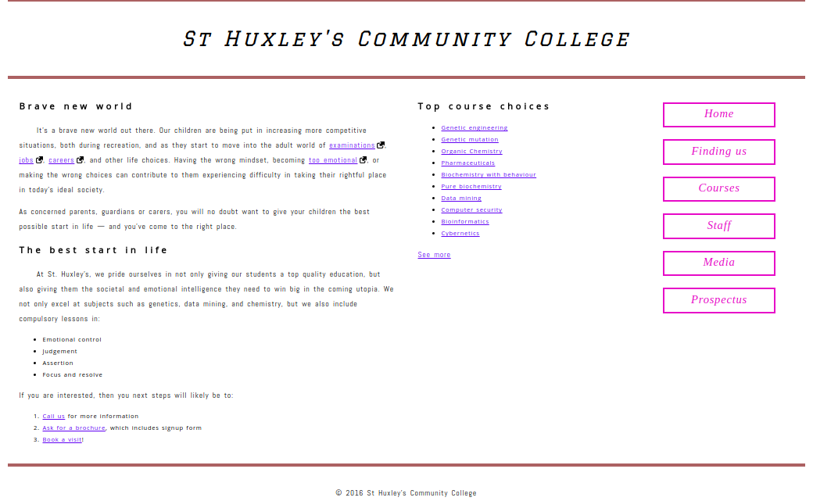

# St Huxley Community College project.

### this is the second project of [the Gomycode.tn](gomycode.tn) fullstack JS bootcamp.

## User Stories

1. <strong>User Story:</strong> The user can view Saint Huxley Community College Home page

    

# What did I learn:

1. More advanced CSS.

2. CSS attribute selectors, floating elements ...